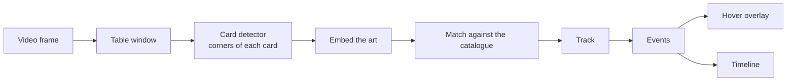

<p align="center">
  <picture>
    <source media="(prefers-color-scheme: dark)" srcset="assets/brand/logo/lockup.svg">
    
  </picture>
</p>

<h3 align="center">Place the ward. See the table.</h3>

<p align="center">A free browser extension for Riftbound streams on Twitch.<br><sub>Alpha · AGPL-3.0 · a community project by Federico Vietti</sub></p>

Wardeye is the ward you place on a Riftbound stream. Point at any card on the table to see its name and official image, as the video plays, live or on replay. It works from the video alone, in your browser: no video leaves your computer.

It is made by Federico Vietti, who also makes [Gradeon](https://gradeon.ai), the AI card pre-grading app. Wardeye shares Gradeon's dark look; it is not a Gradeon product.

## Install

**Chrome Web Store: coming soon.** Until then, watch this page.

- Desktop Chrome or Edge, version 137 or newer.
- A recent graphics chip (WebGPU) makes it fast. Without one it runs on the processor, much more slowly.

## Use it

1. Open a Riftbound stream or replay on twitch.tv.
2. The Wardeye badge on the player says what it is doing: finding the table, then how many cards it has named.
3. Point at a card on the table. The hover card shows its name, its official image, how sure Wardeye is, and what lies under it, such as gear on a unit.

It works in theatre mode and fullscreen. To turn Wardeye off in a tab, use any of these:

- the power button on its badge;
- the Wardeye button in Chrome's toolbar (pin it from the puzzle-piece menu);
- **Alt+R** (Option+R on a Mac).

Off, the overlay is hidden and it reads nothing, and the toolbar button says OFF. The toolbar button or Alt+R turns it back on.

## Status: alpha

What works today, on Twitch: the face-up cards on the table are outlined and named as they are played, with a hover card for each; cards stacked under others are remembered. The recognition runs in the browser, on WebGPU or, more slowly, on the processor.

Not yet: the legends and decklists that narrow the search (next, [below](#next-legends-and-decklists)), the match timeline, YouTube and the side panel ([roadmap](docs/ROADMAP.md)).

## Measured, not claimed

| | Result | Measured on |
|---|---|---|
| Card detector v0 | finds 97.6% of the cards | 5,465 reviewed cards from three broadcasts: Los Angeles 98.1%, Barcelona 99.5%, Shenyang 96.2%. Trained on synthetic boards only ([report](docs/reports/m1-detector-v0.md)) |
| Card identifier v1 | names 96.0% and 99.4% of the cards | two broadcasts held out of training: Barcelona and the Los Angeles grand final ([ml/README](ml/README.md#for-the-browser-m2-the-models-as-onnx)) |
| In the browser | reads like the Python pipeline on 240 of 240 frames | the Los Angeles grand final, through the extension's own engine: the same cards, names and events |

## Next: legends and decklists

The legend rule is built into the engine and comes with the next update of the extension; decklists come after it ([report](docs/reports/m2-decklist-prior.md)).

- **The legends narrow the search, with nothing to set up.**
  - Every card in a Riftbound deck must fit its legend's two domains, runes included.
  - Once Wardeye has read a player's legend, it compares a card on that player's half only with the cards the legend allows, about a third of the gallery.
  - On the hardest match measured, a Swiss round at Barcelona, the share of cards named right rises from **91.8% to 97.8%**, and every confident read is right.
- **Paste the decklists, when they are published.**
  - Paste each player's deck code, or a deckbuilder's export (text, tourney sheet or JSON), and Wardeye looks only among the cards on the list.
  - A listed card counts in every printing, because players often use an alternate art or a reprint instead of the printing on the list. In the Barcelona final, 35% of the card sightings on the table were one of those.
  - Wardeye fetches no list from anywhere; it uses only what you paste.
- **A wrong list can't wreck it.** A list is used only for the player whose legend it names; the other player stays on the legend rule. Applied blindly, another match's lists would name only 8.4% of the cards right.
- **Only for what is face up.** A list only helps name the cards already on the table. Wardeye never shows it, and never uses it to guess a hand or a face-down card ([D-026](docs/decisions.md#d-026-legends-and-published-decklists-narrow-the-search-and-never-reveal-anything)).

## Private by design

- **It runs on your computer.** Recognition happens in your browser. No video leaves your machine, and Wardeye keeps no history and has no account, analytics or ads.
- **Card data comes from Riot.** Names and images load from Riot's public card gallery as you watch; Wardeye ships none of them.
- **Public information only.** It reads only the table camera: never hand cams, face-down cards or the hand lists a broadcast shows.

Details: the [privacy policy](docs/PRIVACY.md).

## How it works



Cards are small on stream (roughly 70–140 px tall at 1080p) and their text is unreadable. So Wardeye identifies cards by **art**: a detector finds each card's corners, an embedder turns its picture into a fingerprint, and the fingerprint is matched against every printing of every card. Details in [ARCHITECTURE.md](docs/ARCHITECTURE.md) and the [research](docs/research/README.md).

## Principles

1. **Public information only.** Hand cams, face-down cards and hidden deck contents are never processed. Wardeye sees only what the broadcast already shows, and a published decklist only helps name what is face up.
2. **Local first.** Inference runs in the viewer's browser, on WebGPU with a WASM fallback. No video leaves the machine.
3. **Measured, not claimed.** Every model comes with results on real broadcasts it was not trained on.
4. **Open and clean.** AGPL code, permissively licensed dependencies and base models, no hidden telemetry. The trained weights ship inside the extension but are not published ([D-022](docs/decisions.md#d-022-free-for-everyone-closed-weights-a-showcase-for-gradeon)).
5. **No footage, card art or card text in Wardeye.** Card data comes from Riot's public card gallery, in your browser. Broadcasts belong to their organisers.

## For developers

```bash
npm install && npm run check          # typecheck, unit tests, guards
npm run test:e2e                      # browser tests, with stand-in models
cd ml && pip install -e '.[dev]' && pytest -q
```

The trained models are not in the repository ([D-022](docs/decisions.md#d-022-free-for-everyone-closed-weights-a-showcase-for-gradeon)): the store version carries them. A build from source has the whole extension but no models, and every test runs on stand-ins. The `ml/` tools include a companion runner used in development ([apps/extension](apps/extension/README.md)). See [CONTRIBUTING.md](CONTRIBUTING.md).

```
apps/extension     the Chrome and Edge extension: the overlay and the in-browser engine host
apps/bench         times the models in Chrome and checks them against PyTorch
apps/logger        timeline logger for ground-truth match logs
apps/reviewer      correct/wrong review of model guesses, turned into labels
apps/viewer        preview: hover the cards of a recorded match, with its timeline
packages/engine    the recognition pipeline in TypeScript, for the browser
packages/schema    timeline, catalogue and layout formats (Apache-2.0)
ml/                catalogue, stream simulator, training, evaluation and the live runner (Python)
assets/brand       the logo, colour tokens and fonts
```

Wardeye was called RiftEye until September 2026 ([D-020](docs/decisions.md#d-020-the-product-is-called-wardeye)); internal code names such as `rifteye_ml` and `@rifteye/*` still say so.

## Documents

| | |
|---|---|
| [Brand book](assets/brand/README.md) | Logo, colour, type, voice and how the product looks |
| [Privacy policy](docs/PRIVACY.md) | What the extension reads, and what it never collects |
| [Research breakdown](docs/research/README.md) | Game model, vision pipeline, models and licences, data, delivery surfaces, prior art, licensing, legal, risks |
| [Architecture](docs/ARCHITECTURE.md) | Components, data contracts, runtime topologies, sync, performance targets |
| [Roadmap](docs/ROADMAP.md) | Milestones M0–M5 with measurable exit criteria |
| [Decision log](docs/decisions.md) | What is settled and why |
| [Releasing](docs/releasing.md) | Making the repository public; the Chrome Web Store release |

## Contributing

Contributions are welcome: bug reports with a timestamp on a public VOD, broadcast layout presets, design critique, prior art. See [CONTRIBUTING.md](CONTRIBUTING.md). Contributors sign a [CLA](CLA.md) on their first pull request and keep the copyright to what they contribute. The project is free for everyone ([D-022](docs/decisions.md#d-022-free-for-everyone-closed-weights-a-showcase-for-gradeon)).

## Licence

- **Code:** [GNU AGPL-3.0-only](LICENSE). Free for everyone ([LICENSING.md](LICENSING.md)).
- **Trained models:** not published and not open source. They ship only inside the extension ([D-022](docs/decisions.md#d-022-free-for-everyone-closed-weights-a-showcase-for-gradeon)).
- **Fonts:** Space Grotesk, Inter and JetBrains Mono, under the SIL Open Font License 1.1 ([assets/brand/fonts](assets/brand/fonts)).
- **Name and logo:** not covered by the AGPL. See [TRADEMARKS.md](TRADEMARKS.md).
- **Governance:** see [GOVERNANCE.md](GOVERNANCE.md). Security reports: see [SECURITY.md](SECURITY.md).

## Legal

Wardeye was created under Riot Games' "Legal Jibber Jabber" policy using assets owned by Riot Games. Riot Games does not endorse or sponsor this project.

Wardeye isn't endorsed by Riot Games and doesn't reflect the views or opinions of Riot Games or anyone officially involved in producing or managing Riot Games properties. Riot Games, and all associated properties are trademarks or registered trademarks of Riot Games, Inc.
