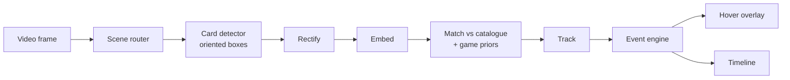

# RiftEye

**Open-source computer vision for Riftbound streams.** A timeline of every card played, and hover-to-inspect cards on Twitch and YouTube.

> **Status: M0 (foundations and feasibility).** Research, architecture and roadmap are written. So far the code covers the data formats (`packages/schema`), a timeline logger for ground truth (`apps/logger`), a correct/wrong reviewer that turns model guesses into labels (`apps/reviewer`) and the feasibility-spike toolkit (`ml/`). The extension comes in M2 ([roadmap](docs/ROADMAP.md)). "RiftEye" is a working name ([why](docs/decisions.md#d-010-rifteye-is-a-working-name)).

## What it will do

- **Hover a card on the table** in a Riftbound broadcast and see the card: art, name and text.
- **Follow the match as a timeline**: cards played, spells cast, units moved, turns and score. Click any event to jump to that moment in the video.
- **See the match at a glance**: each player's legend, battlefields and every card seen so far.

It works from the video alone, in your browser, on streams you are already watching. No video leaves your machine.

## How it works



Cards are small on stream (roughly 70–140 px tall at 1080p) and their text is unreadable. So RiftEye identifies cards by **art**, then narrows the candidates with what the game itself reveals:

- the legend's two domains;
- published decklists;
- how many runes were just tapped;
- which way a card faces.

Details in [ARCHITECTURE.md](docs/ARCHITECTURE.md) and the [research](docs/research/README.md).

## Principles

- **Public information only.** Hand cams, face-down cards and deck contents are never processed.
- **Local first.** Inference runs in the viewer's browser, with WebGPU and a WASM fallback.
- **Measured, not claimed.** Every model ships with results on a real, event-split test set.
- **Open and clean.** AGPL code, and permissively licensed dependencies and weights only.
- **No footage, card art or card text in RiftEye.** The extension loads card data from Riot's public card gallery in your browser, and broadcasts belong to their organisers.

## Documents

| | |
|---|---|
| [Research breakdown](docs/research/README.md) | Game model, vision pipeline, models and licences, data, delivery surfaces, prior art, licensing, legal, risks |
| [Architecture](docs/ARCHITECTURE.md) | Components, data contracts, runtime topologies, sync, performance targets |
| [Roadmap](docs/ROADMAP.md) | Milestones M0–M5 with measurable exit criteria |
| [Decision log](docs/decisions.md) | What is settled and why |

## Repository layout

```
apps/extension     Chrome/Edge extension: overlay, inference host, side panel   (M2)
apps/logger        timeline logger for ground-truth match logs               (now)
apps/reviewer      correct/wrong review of model guesses, turned into labels  (now)
apps/web           VOD library with synced timelines            (later)
apps/broadcaster   OBS sidecar for organisers                   (later)
packages/core      tracker, event engine, fusion, shared types
packages/vision    ONNX Runtime Web wrappers, pre/post-processing, gallery search
packages/schema    timeline, catalogue and layout formats (Apache-2.0)        (now)
layouts/           community broadcast layout presets (CC0)
ml/                catalogue, stream simulator, M0 spike, training, evaluation (now)
services/          VOD pipeline                                  (later)
```

## Contributing

Contributions are welcome: design critique, broadcast layout presets, prior art, labeling. See [CONTRIBUTING.md](CONTRIBUTING.md). Contributors sign a [CLA](CLA.md) on their first pull request. You keep your copyright, and the CLA lets the Maintainer also offer RiftEye under commercial terms ([why](docs/research/07-licensing-and-governance.md)).

## Licence

- **Code:** [GNU AGPL-3.0-only](LICENSE). Commercial licences are available from the Maintainer ([LICENSING.md](LICENSING.md)).
- **Name and logo:** not covered by the AGPL. See [TRADEMARKS.md](TRADEMARKS.md).
- **Governance:** see [GOVERNANCE.md](GOVERNANCE.md). Security reports: see [SECURITY.md](SECURITY.md).

## Legal

RiftEye was created under Riot Games' "Legal Jibber Jabber" policy using assets owned by Riot Games. Riot Games does not endorse or sponsor this project.

RiftEye isn't endorsed by Riot Games and doesn't reflect the views or opinions of Riot Games or anyone officially involved in producing or managing Riot Games properties. Riot Games, and all associated properties are trademarks or registered trademarks of Riot Games, Inc.
