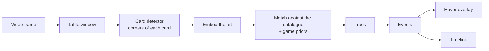

<p align="center">
  <picture>
    <source media="(prefers-color-scheme: dark)" srcset="assets/brand/logo/lockup.svg">
    
  </picture>
</p>

<h3 align="center">Place the ward. See the table.</h3>

<p align="center">Open-source computer vision for Riftbound streams.<br><sub>Alpha · milestone M2 · AGPL-3.0 · a community project by Federico Vietti</sub></p>

Wardeye is the ward you place on a Riftbound stream. Hover any card to inspect it, follow the match as a timeline, and see the whole board at a glance: open-source, in your browser, from the video alone.

It is made by Federico Vietti, who also makes [Gradeon](https://gradeon.ai), the AI card pre-grading app. Wardeye shares Gradeon's dark look; it is not a Gradeon product.

> **Status: alpha, not released yet.** The card detector and the card identifier are trained and tested on real broadcasts. The extension boxes and names the cards on the Twitch player as the video plays, either in the browser itself (the private build) or through a runner on the same computer. The current milestone is M2, the extension alpha; next, the in-browser build loads card data from Riot's gallery as you watch, so it can be released ([roadmap](docs/ROADMAP.md)).

## What it will do

- **Hover to inspect.** Point at a card on the table and see its art, name and text.
- **Match timeline.** Cards played, spells cast, units moved, turns and score. Click any event to jump to that moment.
- **Match at a glance.** Each player's legend, the battlefields and every card seen so far.

It works from the video alone, on streams you already watch. The recognition runs on your computer, and no video leaves it.

## Measured, not claimed

| | Result | Measured on |
|---|---|---|
| Card detector v0 | finds 97.6% of the cards | 5,465 reviewed cards from three broadcasts: Los Angeles 98.1%, Barcelona 99.5%, Shenyang 96.2%. Trained on synthetic boards only ([report](docs/reports/m1-detector-v0.md)) |
| Card identifier v1 | names 96.0% and 99.4% of the cards | two broadcasts held out of training: Barcelona and the Los Angeles grand final ([ml/README](ml/README.md#for-the-browser-m2-the-models-as-onnx)) |
| In the browser | reads like the Python pipeline on 240 of 240 frames | the Los Angeles grand final, through the extension's own engine: the same cards, names and events |

## How it works



Cards are small on stream (roughly 70–140 px tall at 1080p) and their text is unreadable. So Wardeye identifies cards by **art**. From M3 it will also narrow the candidates with what the game itself reveals: the legend's two domains, published decklists, how many runes were just tapped, which way a card faces. Details in [ARCHITECTURE.md](docs/ARCHITECTURE.md) and the [research](docs/research/README.md).

## Principles

1. **Public information only.** Hand cams, face-down cards and deck contents are never processed. Wardeye sees only what the broadcast already shows.
2. **Local first.** Inference runs in the viewer's browser, on WebGPU with a WASM fallback. No video leaves the machine.
3. **Measured, not claimed.** Every model comes with results on real broadcasts it was not trained on.
4. **Open and clean.** AGPL code, permissively licensed dependencies and base models, no hidden telemetry. The trained weights ship inside the extension but are not published ([D-022](docs/decisions.md#d-022-free-for-everyone-closed-weights-a-showcase-for-gradeon)).
5. **No footage, card art or card text in Wardeye.** Card data comes from Riot's public card gallery, in your browser. Broadcasts belong to their organisers.

## Documents

| | |
|---|---|
| [Brand book](assets/brand/README.md) | Logo, colour, type, voice and how the product looks |
| [Research breakdown](docs/research/README.md) | Game model, vision pipeline, models and licences, data, delivery surfaces, prior art, licensing, legal, risks |
| [Architecture](docs/ARCHITECTURE.md) | Components, data contracts, runtime topologies, sync, performance targets |
| [Roadmap](docs/ROADMAP.md) | Milestones M0–M5 with measurable exit criteria |
| [Decision log](docs/decisions.md) | What is settled and why |
| [Privacy policy](docs/PRIVACY.md) | What the extension reads, and that it collects and sends nothing |
| [Releasing](docs/releasing.md) | Making the repository public; the Chrome Web Store release |

## Repository layout

```
apps/extension     the Chrome and Edge extension: the overlay and the in-browser engine host
apps/bench         times the models in Chrome and checks them against PyTorch
apps/logger        timeline logger for ground-truth match logs
apps/reviewer      correct/wrong review of model guesses, turned into labels
apps/viewer        preview: hover the cards of a recorded match, with its timeline
packages/engine    the recognition pipeline in TypeScript, for the browser
packages/schema    timeline, catalogue and layout formats (Apache-2.0)
ml/                catalogue, stream simulator, training, evaluation and the live runner (Python)
assets/brand       the logo, colour tokens and fonts
```

Later: a VOD library with synced timelines (`apps/web`), a broadcaster kit for organisers (`apps/broadcaster`) and community layout presets (`layouts/`). Wardeye was called RiftEye until September 2026 ([D-020](docs/decisions.md#d-020-the-product-is-called-wardeye)); internal code names such as `rifteye_ml` and `@rifteye/*` still say so.

## Contributing

Contributions are welcome: design critique, broadcast layout presets, prior art, labeling. See [CONTRIBUTING.md](CONTRIBUTING.md). Contributors sign a [CLA](CLA.md) on their first pull request and keep the copyright to what they contribute. The project is free for everyone ([D-022](docs/decisions.md#d-022-free-for-everyone-closed-weights-a-showcase-for-gradeon)).

## Licence

- **Code:** [GNU AGPL-3.0-only](LICENSE). Free for everyone ([LICENSING.md](LICENSING.md)).
- **Trained models:** not published and not open source. They ship only inside the extension ([D-022](docs/decisions.md#d-022-free-for-everyone-closed-weights-a-showcase-for-gradeon)).
- **Fonts:** Space Grotesk, Inter and JetBrains Mono, under the SIL Open Font License 1.1 ([assets/brand/fonts](assets/brand/fonts)).
- **Name and logo:** not covered by the AGPL. See [TRADEMARKS.md](TRADEMARKS.md).
- **Governance:** see [GOVERNANCE.md](GOVERNANCE.md). Security reports: see [SECURITY.md](SECURITY.md).

## Legal

Wardeye was created under Riot Games' "Legal Jibber Jabber" policy using assets owned by Riot Games. Riot Games does not endorse or sponsor this project.

Wardeye isn't endorsed by Riot Games and doesn't reflect the views or opinions of Riot Games or anyone officially involved in producing or managing Riot Games properties. Riot Games, and all associated properties are trademarks or registered trademarks of Riot Games, Inc.
