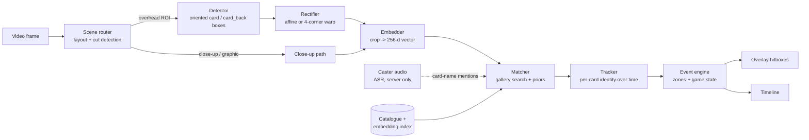
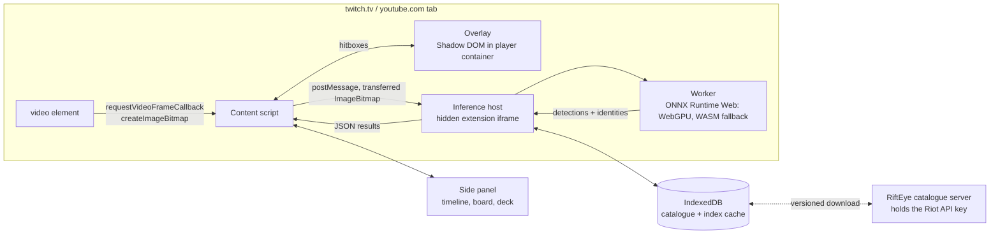

# RiftEye architecture

> **Status:** design, v0.1 (September 2026). Nothing below is implemented yet.
> This document describes the target system that the [roadmap](ROADMAP.md) builds toward.
> The reasoning and sources behind each choice are in [`docs/research/`](research/README.md).
> Settled choices are logged in [decisions.md](decisions.md).

## 1. What the system does

**Input:** video of a Riftbound match. That can be a Twitch or YouTube stream (live or VOD), a local video file, or, for the broadcaster kit, the raw camera feed.

**Output:**

1. **Board overlay.** At any moment, the outline and identity of each face-up card visible on the table. Hovering a card in the video shows that card.
2. **Timeline.** An ordered log of game events, each tied to a video timestamp: card played, spell cast, unit moved, exhausted or readied, turn start.
3. **Match summary.** For each player: legend, battlefields, and every card seen, which gives an inferred partial decklist.

**Hard rule:** RiftEye only reports what is public on the table. Hand cams and face-down cards are never read. See [§10](#10-non-goals-and-integrity-rules).

## 2. The pipeline at a glance



| # | Stage | What it does | Model | Runs how often |
|---|---|---|---|---|
| 1 | **Scene router** | Finds the region of the frame that holds the overhead table camera, a card close-up, or a production graphic. Detects camera cuts. | Layout preset per broadcast, plus a tiny frame classifier | Every sampled frame (cheap) |
| 2 | **Detector** | Oriented boxes for `card` (face-up) and `card_back` inside the overhead ROI | Browser: RT-DETRv2-OBB-S or D-FINE-S. Server: RF-DETR keypoint. All Apache-2.0 ([03](research/03-models-and-licensing.md), [D-013](decisions.md#d-013-browser-detector-is-a-small-cnn-or-obb-model-rf-detr-runs-on-the-server)) | 2–5 Hz |
| 3 | **Rectifier** | Warp to a canonical upright crop: affine from the oriented box, or a homography from 4 corners when the camera is tilted | Optional corner heatmap refiner ([06](research/06-prior-art-and-starting-point.md#64-starting-point-the-maintainers-card-recognition-work)) | New or moved tracks only |
| 4 | **Embedder** | Crop to an L2-normalised vector | DINOv2-S/14 or Perception Encoder S16, fine-tuned with Sub-center ArcFace | New or unresolved tracks, plus periodic re-checks |
| 5 | **Matcher** | Cosine search over every printing, re-ranked with game priors, aggregated per track | Brute force (the gallery is a few thousand vectors) | Per embedding |
| 6 | **Tracker** | Keeps one identity per physical card across frames, occlusions and moves | IoU association plus embedding re-ID | Every detection pass |
| 7 | **Event engine** | Turns track changes into game events, per zone and per player | Rules and state machine; learned later | Every detection pass |

Two principles set the compute budget:

- **Detect at low resolution, identify at native resolution.** The detector sees a downscaled ROI, where it only has to find rectangles. Identification crops come from the full-resolution frame, where every pixel of card art counts.
- **Identify once per card, not once per frame.** Cards on a table barely move. Once a track has a confident identity, later frames only confirm it. The embedder runs when something is new, has moved or is still uncertain.

## 3. Stage details

### 3.1 Scene router

Tournament broadcasts are composites. The overhead cam usually sits in a sub-window next to player cams, a scoreboard and caster graphics, and production cuts between cameras.

- **Layout presets** (`layouts/*.json`) are the community-maintained answer: one small JSON file per broadcaster, listing the regions of the composite frame. This is the easiest place for a new contributor to help.
- **Auto-discovery** is the fallback. Detections accumulate into a heatmap over a few seconds, and the dense region is the table.
- **Cut detection** uses frame-difference plus histogram distance. On a cut, tracks are frozen rather than dropped, and re-associated when the table view returns.
- **Close-ups and production graphics** (a full-screen card when it is played) go straight to the embedder. These are the highest-confidence identifications RiftEye will ever get.

### 3.2 Detector

- Classes: `card`, `card_back`. Orientation (upright, exhausted, opponent side) comes from geometry, not from separate classes.
- Trained on synthetic board renders plus real stream frames. See [data strategy](research/04-data-and-evaluation.md).
- Input: the overhead ROI resized to 640 px on the long side. When cards fall under about 25 px at that scale, the ROI is tiled (SAHI-style) instead.

### 3.3 Rectifier and orientation

- Each box maps back to the **full-resolution** frame. For near-overhead cameras, an affine warp from the oriented box is enough. When the camera is tilted, a corner heatmap network predicts TL/TR/BR/BL inside the crop, and soft-argmax turns them into sub-pixel corners for a homography. The same architecture already works on phone photos of single cards in Gradeon.
- The warp targets a canonical portrait size: 176×246, the 63×88 mm card ratio. Landscape card types (battlefields) are warped to the transposed size.
- **Orientation** is ambiguous from the camera's point of view. The opponent's cards appear upside down and exhausted cards lie sideways. Rather than training a separate classifier, the matcher embeds all four 90° rotations in one batch and keeps the best score. The gallery is tiny, so this costs one batched forward pass.

### 3.4 Embedder

- Output: 256-d, L2-normalised, stored as float16 in the index.
- Backbone: DINOv2-S/14 or Perception Encoder S16 (both Apache-2.0).
- Objective: Sub-center ArcFace, with a contrastive baseline already proven on phone photos (NT-Xent with a negatives queue). Model selection is always on *real* held-out data.
- The augmentations are rebuilt for the stream domain: downscale to 40–160 px card height, H.264 re-encode, chroma subsampling, sleeves, stage lighting, motion blur and partial occlusion.
- The base model's weights must be licensed for redistribution and commercial use ([03](research/03-models-and-licensing.md)).

### 3.5 Matcher, priors and fusion

For each track, the matcher keeps a quality-weighted set of embeddings. Quality is crop area × sharpness (Laplacian variance) × (1 − glare fraction). It scores every gallery printing:

```
score(card) = log p_visual(card | embeddings)      # temperature-scaled cosine, aggregated over the track
            + log p_context(card | match state)    # priors below
            + log p_audio(card | mentions ±10 s)   # server pipeline only
```

Context priors, from strongest to weakest:

1. **Zone/type consistency.** Battlefields only in battlefield slots (they are the only landscape cards), legends only in the legend zone, runes only in the rune row.
2. **Legend domains.** The legend is identified early. It is large, static and visible all game, and its two domains cut the main-deck candidates to about a third of the pool ([01 §1.6](research/01-game-model.md#16-deck-rules-as-recognition-priors)).
3. **Published decklists.** When the tournament publishes lists, the candidates collapse to that player's 40 cards.
4. **Rune-tap cost.** When *N* runes were just exhausted, the card being played most likely costs *N* energy. Printed costs are in the catalogue.
5. **Seen before.** Cards already confirmed for this player in this match or event get a boost.

**Controller** is geometry, not identity. At high-level events, ready cards face their controller and exhausted cards are all rotated the same way (Tournament Rules 508.10). The rotation the matcher found in §3.3 therefore also tells us whose card it is, even on the shared battlefields.

A track's identity is **committed** when the top score stays ahead of the runner-up by a calibrated margin for N observations. Until then the overlay shows "unknown card" with the top-3 candidates. A guess is never shown as fact.

### 3.6 Tracker

- ByteTrack-style two-pass IoU association. The overhead cam is static, so plain IoU does most of the work.
- **Embedding re-ID** stitches a track that vanished in one zone to a new one in another: the same card moved from base to a battlefield. That produces `card_moved`, not `card_left_play` plus `card_played`.
- Tracks survive short occlusions (hands) for a few seconds, and survive camera cuts (see 3.1).

### 3.7 Event engine

A per-match state machine over a board model. For each player, a board model holds the zones: legend, champion, base, rune row, the two battlefields (each with its facedown slot), and trash. Each zone holds tracks, and each track has an identity, a controller and a ready or exhausted state. The game facts behind these rules are in [01 §1.4–1.5](research/01-game-model.md#14-turn-structure-and-what-the-camera-sees).

| Event | Trigger (v1 heuristics) |
|---|---|
| `game_start` | Legends, chosen champions and battlefields visible; board otherwise empty |
| `turn_start` | Mass readying on one side of the table (Awaken phase) |
| `runes_channeled` | Two new runes in a player's rune row |
| `card_played` | New committed face-up track in a player's base or at a battlefield. Units usually arrive exhausted. |
| `spell_cast` | Face-up card seen briefly (the Chain) that then lands on the owner's trash, or a production graphic |
| `card_moved` | Re-ID links a vanished track to a new one in another zone |
| `card_exhausted` / `card_readied` | Track rotation flips between ready and exhausted |
| `card_hidden` | Face-down card placed at a battlefield. **No identity is ever inferred.** |
| `card_revealed` | That face-down card turns face up |
| `score_changed` | Broadcast point track changes (OCR of the overlay) |
| `card_left_play` | Committed track gone for more than T seconds with no re-ID match (low confidence) |

**Take-backs.** Players may reverse their most recent action (Tournament Rules 509). If a just-played card leaves the board within a few seconds without reaching the trash, the engine emits a retraction for the earlier event instead of `card_left_play`.

In **VOD mode**, the engine is non-causal. It can look ahead and back, pick each track's best frame for identity and back-fill earlier events. In **live mode**, it holds events in a 2–3 s confirmation buffer before showing them.

## 4. Identity model: gameplay card vs printing

The timeline talks about **cards** (gameplay identity: a name and its rules). The overlay can also show the **printing** (set, collector number, alt art, language) when it is confident.

- Different art (alt art, overnumbered, showcase) is separable by embedding.
- Same-art reprints and language variants are not separable at stream resolution. They stay grouped under one card, and the printing is left unresolved.
- Metrics are reported at both levels. The product metric is card-level.

## 5. Runtime topologies

### 5.1 Browser extension (first public surface)



- **All inference is local.** No video leaves the user's machine. Models and the WASM runtime ship inside the extension package. Store policy details are in [05](research/05-delivery-surfaces.md).
- **Why an iframe.** Extension messaging carries JSON only, so frames cannot reach an offscreen document without copies, and content scripts live under the host page's CSP. A web-accessible extension iframe runs under the extension's own CSP, can be cross-origin isolated for WASM threads, and receives frames zero-copy. It is prototyped against the alternatives in M2 ([05 §5.2](research/05-delivery-surfaces.md#52-browser-extension-manifest-v3)).
- **Card data and art come from the RiftEye catalogue server,** which builds them from the Riot API. The key never ships in client code ([D-011](decisions.md#d-011-card-data-and-art-come-only-from-the-riot-api)).
- The overlay is attached inside the player container, so it survives theatre mode and fullscreen. It maps intrinsic video coordinates to CSS pixels, accounting for letterboxing.
- The catalogue and embedding index are versioned data files downloaded from a CDN and cached. Forks can point to their own catalogue URL.
- Inference pauses when the tab is hidden or the video is paused. An eco mode caps detection at 1 Hz.

### 5.2 VOD pipeline (research engine, later a hosted service)

Python and ONNX Runtime on a GPU box: ingest, 2–5 fps sampling with extra frames at scene changes, the same models as the extension (plus larger ones), then ASR on the audio track and the non-causal event engine. Output: `timeline.json` per VOD.

This is also the **data engine**. Its outputs become pseudo-labels for the next training round. On Twitch or YouTube the media clock is the VOD offset, so an extension viewing a processed VOD can show the precomputed timeline with no sync problem.

### 5.3 Broadcaster kit (later)

It runs on the tournament's production PC as a **sidecar**. Through obs-websocket it reads the clean overhead camera: uncompressed, full resolution, so accuracy is best here. It is not a native OBS plugin, because OBS's GPL would conflict with dual licensing ([D-014](decisions.md#d-014-broadcaster-kit-is-a-sidecar-process-not-a-native-obs-plugin)). It drives an OBS Browser Source overlay (card pop-ups when played, board graphics), which is burned into the stream, so mobile and VOD viewers see it too. It can also feed a Twitch Extension, so desktop viewers get hover without installing anything. See [05](research/05-delivery-surfaces.md).

### 5.4 Web app (later)

Twitch and YouTube embed rules forbid overlaying or modifying their players. So the web app shows a **time-synced card rail and timeline beside** the embedded player, and clicking an event seeks the video. Drawing on the video itself remains an extension feature.

## 6. Data contracts

These types live in `packages/schema` and are shared by every surface. That package is Apache-2.0, so other tools can read and write RiftEye data freely ([LICENSING](../LICENSING.md)). Everything is versioned, so old timelines stay readable.

```ts
/** One printed card face. Many printings share one gameplay card. */
interface Printing {
  printingId: string;        // stable, e.g. "OGN-066" or "OGN-301/298"
  cardId: string;            // gameplay identity
  setCode: string;           // "OGN", "SFD", ...
  collectorNumber: string;
  variant: 'standard' | 'alt_art' | 'overnumbered' | 'showcase' | 'signature' | 'promo' | 'token';
  language: string;          // BCP-47, "en", "zh-Hans", ...
  imageUrl: string;          // served by the catalogue server from Riot API assets (D-011); never stored in this repo
  orientation: 'portrait' | 'landscape';
}

interface Card {
  cardId: string;
  name: string;
  type: string;              // "Unit", "Spell", "Gear", "Legend", "Battlefield", "Rune", ...
  domains: string[];
  rulesText?: string;
  printings: string[];       // printingId[]
}

/** Shipped as manifest.json next to a float16 matrix. */
interface EmbeddingIndexManifest {
  catalogVersion: string;    // bump on any catalogue change
  model: string;             // encoder tag; must equal the running encoder, or matching refuses to run
  modelSha256: string;
  dim: number;
  rows: string[];            // printingId per row, same order as the matrix
}

type EventType =
  | 'game_start' | 'game_end' | 'turn_start' | 'runes_channeled' | 'score_changed'
  | 'card_played' | 'spell_cast' | 'card_moved'
  | 'card_exhausted' | 'card_readied' | 'card_left_play'
  | 'card_hidden' | 'card_revealed'
  | 'retracted';             // a take-back: `retracts` names the event being withdrawn

interface TimelineEvent {
  id: string;                // ULID
  matchId: string;
  t: number;                 // seconds on `clock`
  clock: 'media' | 'wall';   // media = VOD offset; wall = UTC ms for live
  type: EventType;
  player: 'A' | 'B' | null;  // controller; A = bottom of the overhead frame unless the layout says otherwise
  zone?: 'legend' | 'champion' | 'base' | 'runes' | 'battlefield_1' | 'battlefield_2'
       | 'facedown_1' | 'facedown_2' | 'chain' | 'trash' | 'banishment' | 'unknown';
  retracts?: string;         // for 'retracted'
  score?: { A: number; B: number };  // for 'score_changed'
  card?: {
    cardId: string | null;   // null = detected but not identified
    printingId?: string;
    confidence: number;      // calibrated 0..1
    alternatives?: { cardId: string; confidence: number }[];
  };
  quad?: [number, number, number, number, number, number, number, number]; // normalised video coords
  evidence: ('vision' | 'graphic' | 'audio' | 'decklist' | 'manual')[];
  engine: string;            // "rifteye/0.3.0+det-v4+emb-v7"
}

/** layouts/<broadcaster>.json -- community maintained. */
interface LayoutPreset {
  id: string;
  match: { channels?: string[]; youtubeChannelIds?: string[] };
  regions: Partial<Record<'overhead' | 'closeup' | 'graphic' | 'handcam' | 'scoreboard', [number, number, number, number]>>;
  playerA: 'bottom' | 'top' | 'left' | 'right';
  validFrom?: string;        // broadcasts change layouts between events
}
```

## 7. Clocks and synchronisation

| Situation | Clock | How the overlay lines up |
|---|---|---|
| Extension, local inference | Frame being presented | Trivial: boxes come from the same frame |
| Extension showing a processed VOD | `media` (VOD offset) | Read the player position; verify with a frame fingerprint |
| Extension on a live stream processed server-side | `wall` | Map the viewer's playhead to wall time (HLS program-date-time), falling back to fingerprint alignment |
| Twitch Extension fed by the broadcaster kit | `wall` | Delay by the viewer's broadcaster latency, reported by Twitch's extension helper |

Fingerprint alignment is the universal fallback. Both sides compute a 64-bit perceptual hash of the ROI a few times per second, and the offset that best aligns the two hash sequences is the sync.

## 8. Model and index versioning

A lesson from earlier card-recognition work: an index built by one encoder and queried with another returns confident nonsense, and it does so silently. So every index names the encoder that built it. The matcher refuses to run when the running encoder's tag or hash differs from the index manifest, and it says so clearly rather than failing silently. Model releases bump the catalogue version.

## 9. Performance targets (to be validated in M2)

| Reference machine | Detection | Embedding per crop | CPU/GPU use while watching |
|---|---|---|---|
| Laptop with Intel Iris Xe, WebGPU | ≥ 2 Hz | ≤ 30 ms | Must not drop video frames |
| Apple M1, WebGPU | ≥ 5 Hz | ≤ 15 ms | |
| Desktop RTX 3060 class | ≥ 10 Hz | ≤ 5 ms | |
| Any, WASM fallback | ≥ 0.5 Hz | ≤ 150 ms | Eco mode by default |

## 10. Non-goals and integrity rules

- **No hidden information, ever.** Hand cams, face-down cards and deck tops are masked out by the scene router and never processed, even when a broadcast shows them. RiftEye must not become a stream-sniping aid, and tournament organisers need to be able to trust that.
- **No gameplay automation.** No rules engine that plays for anyone, no online play client, no simulator.
- **No card images in this repository.** Art is loaded at runtime from allowed sources ([08](research/08-legal-and-policy.md)).
- v1 targets 1v1 (the organised-play format). Team and free-for-all formats come later.
