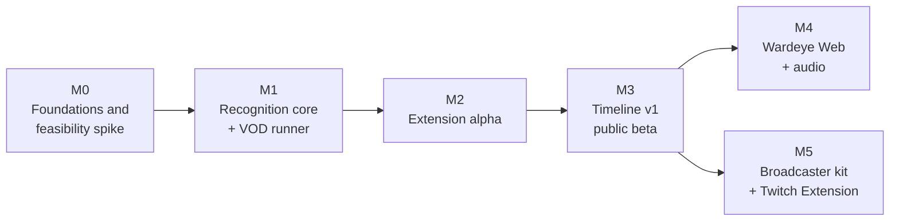

# Wardeye roadmap

Milestones are ordered, not dated. Sizes assume one maintainer plus a few regular contributors, and they are estimates. Every milestone ends with **exit criteria measured on real stream data**, not on synthetic data ([why](research/04-data-and-evaluation.md#48-the-m0-feasibility-spike)).

## M0: Foundations and feasibility (about 2 weeks)

- [x] Repository, licence, CLA, contribution rules, architecture and research docs
- [ ] **Final name:** Wardeye, chosen ([D-020](decisions.md#d-020-the-product-is-called-wardeye)); a trademark search must clear it before the public launch
- [ ] Footage: written agreements requested from 3–5 organisers; our own consented recording sessions planned; `sources.yaml` started
- [x] Catalogue v0: every printing from Riot's public card gallery in the `Card` / `Printing` schema, built on the Maintainer's machine and never redistributed ([D-015](decisions.md#d-015-no-riot-api-no-riot-assets-distributed)). 1,189 printings (936 cards) on 2026-09-26, plus Simplified and Traditional Chinese and Korean printings of Origins
- [x] Timeline logger v0 (`apps/logger`)
- [ ] First 5 matches logged with it
- [x] Reviewer v0 (`apps/reviewer`): correct/wrong review of model guesses, and `reviewpack` to build packs and merge answers ([D-018](decisions.md#d-018-labels-come-from-reviewing-model-proposals))
- [x] First review packs answered and merged: 400 identity tracks in 13.6 minutes (960 crops labelled) and 57 change-gate events (77% real card changes) from the M0 reference VOD
- [x] Viewer preview (`apps/viewer`): the hover card and timeline on a recorded match, computed offline by the M0 pipeline (`ml/rifteye_ml/demo.py`)
- [x] Feasibility spike tooling (`ml/`: stream simulator with a real H.264 pass, encoders, retrieval metrics)
- [ ] **Feasibility spike run**: accuracy-vs-card-height curves, synthetic and real ([04 §4.8](research/04-data-and-evaluation.md#48-the-m0-feasibility-spike)), plus identification from a visible strip for stacked cards. Done for two broadcasts: synthetic curves, the bitrate sweep, strips for stacked cards (simulated and cut from real cards), a quick fine-tune, and reviewed real sets from Shenyang (2,381 crops, cards about 130 px) and the Los Angeles RQ (1,383 crops, about 166 px): [M0 report](reports/m0-spike.md). The first identifier scores colour and structure together ([D-019](decisions.md#d-019-the-first-identifier-scores-colour-and-structure-together)): 96.6% at Shenyang, 96.3% at 720p, 81.0% at Los Angeles, where players keep a die on their legend. On a third broadcast that nothing was tuned on (Barcelona), it names 95.9%. Still needed: real crops below 85 px (picture-in-picture). Real stacks wait for the M1 amodal detector: two cheap ways to label them did not work ([report §7](reports/m0-spike.md#7-stacked-cards-identity-from-a-strip))
- [ ] Choose the embedder base model (DINOv2-S vs Perception Encoder S) and the browser detector (RT-DETRv2-OBB vs D-FINE) from the spike ([03](research/03-models-and-licensing.md)). **Embedder: DINOv2-S.** It wins frozen in every setting and, with a linear head trained only on synthetic crops, on the real set at 1080p and 720p (72% and 71%, against 48% and 49% for PE-S) and on the other two broadcasts (64% and 69%, against 54% and 52%). PE-S generalises better at 40–80 px in simulation only ([report §8](reports/m0-spike.md#8-quick-fine-tune)). The detector choice moves to M1 benchmarks

**Exit:** the M0 report is published in `docs/reports/`, with a go / adjust decision per broadcast framing (full-screen vs picture-in-picture, 1080p vs 720p).

## M1: Recognition core and VOD runner (about 4–6 weeks)

- [x] `ml/synth` v0: synthetic boards with the real codec pass (`python -m rifteye_ml.synth`, [ml/README](../ml/README.md#synthetic-boards-m1)), calibrated once against the M0 broadcasts: fully visible synthetic cards are now about as hard to name as Shenyang's, legends still easier than at Los Angeles and Barcelona ([report](reports/m1-synth-v0.md)). 400 boards rendered
- [x] Synthetic stacks: fanned piles, rune rows and columns, attached gear and piles, with full-quad ground truth, visible fractions and id maps
- [ ] Detector v0 (`card`, `card_back`), amodal (full quad plus visible fraction): synthetic data plus about 500 verified real frames. Built: RF-DETR keypoint on the four corners, with per-corner visibility (`python -m rifteye_ml.detect`, [ml/README](../ml/README.md#card-detector-m1)), and a one-command GPU job (`ml/scripts/m1-detector.sh`). **Trained on synthetic boards only, it finds 97.6% of the 5,465 reviewed cards of the three M0 broadcasts** (98.1% Los Angeles, 99.5% Barcelona, 96.2% Shenyang) and every fully visible synthetic card ([report](reports/m1-detector-v0.md)). Still needed: the real frames, starting with covered-card labels from its own proposals
- [ ] Rectifier: corner heatmap network retrained on stream crops
- [ ] Embedder v0: DINOv2-S fine-tuned with random covering, text scrambling and foil-like colour shifts, exported to ONNX (fp16 and int8), float16 index plus manifest, with strip views and a gallery pyramid. Built: Sub-center ArcFace over cards on a synthetic crop bank, one model on three sets for the held-out test and one on every set (`python -m rifteye_ml.embed`, [ml/README](../ml/README.md#card-embedder-m1)), and a GPU job that queues after the detector's (`ml/scripts/m1-embedder.sh`). v0 trained on synthetic crops only; v1 adds the reviewed real crops of Shenyang and Los Angeles, with Barcelona and the Los Angeles grand final held out to score it
- [ ] `ml/evalsuite` v0: frozen real test sets, the leaderboard, per-bucket metrics
- [ ] Change gate evaluated against logged timelines: recall and precision of board changes ([D-016](decisions.md#d-016-a-change-gate-decides-when-and-where-the-heavy-stages-run))
- [ ] Python VOD runner: change gate, then detection and identification on changed regions, naive timeline JSON

**Exit:** detection recall ≥ 95% for cards ≥ 50 px on the out-of-domain test set. Card-level top-1 reported per size bucket. The VOD runner works end to end on 5 matches.

## M2: Browser extension alpha (about 4–6 weeks)

- [ ] Manifest V3 extension for Chrome and Edge: overlay hitboxes and hover card on Twitch and YouTube, in theatre mode and fullscreen. Alpha built for Twitch ([apps/extension](../apps/extension/README.md)). It draws on the player what it reads from the frames: in the browser itself (standalone, the private build) or through the live runner on the same computer (companion). YouTube to come
- [ ] Inference host prototype (extension iframe vs content-script worker vs `tabCapture` + offscreen document), then ONNX Runtime Web in a worker (WebGPU, WASM fallback), eco mode, pause when hidden. First step done: both models exported to ONNX (`detect onnx`, `embed onnx`; [ml/README](../ml/README.md#for-the-browser-m2-the-models-as-onnx)). The copies give the same answers as PyTorch on the held-out broadcasts. [apps/bench](../apps/bench/README.md) times them in Chrome. On an Apple-silicon Mac (Chrome 154, native WebGPU runtime, fp16), the detector takes 44.5 ms per 576 tile and the embedder 22.5 ms for a frame's 8 crops. That is about 15 frames a second on the LA layout; the WASM fallback manages 0.64. Then the whole pipeline in TypeScript ([packages/engine](../packages/engine/README.md)), each part checked against its Python original, running in the extension's offscreen document on WebGPU or WASM, with the companion as a fallback. On the LA final's 240 frames, through the extension's own engine with the real models, it reads every frame like Python: the same cards, names and events on all 240 frames; 24 differ only by a rounding of 0.1 px in a corner. The detector runs in float32, the embedder in float16 ([D-023](decisions.md#d-023-in-the-browser-the-detector-runs-in-float32-and-the-embedder-in-float16))
- [ ] Change gate in the extension (canvas or WebGL differences on a small table view) driving detection
- [ ] Experiment: a typed-decision verifier for gate events (Laya-style, our own checkpoint from an Apache-2.0 base), kept only if it beats gate plus detector rules. Trained on reviewed before/after pairs; the first 57 are in
- [ ] Side panel: live board and a simple timeline
- [ ] Gallery adapter (card data loaded from Riot's public gallery at display time); index download with versioning and the model/index guard
- [ ] Benchmarks on the reference machines ([ARCHITECTURE §9](ARCHITECTURE.md#9-performance-targets-to-be-validated-in-m2))

**Exit:** ≥ 2 Hz detection on an Intel Iris Xe laptop without dropped video frames. Private alpha with about 20 community testers.

## M3: Timeline v1 and public beta (about 6–8 weeks)

- [ ] Tracker with re-ID and cut handling, and covered cards that keep their identity while stacked; event engine v1 over piles (played, cast, moved, exhausted/readied, turn start)
- [ ] Priors: zone and type, legend domains, decklist import, seen-before
- [ ] Layout presets for the main broadcasters (`layouts/*.json`); auto-discovery fallback
- [ ] Opt-in "Wrong card?" corrections into the active-learning queue
- [ ] Data engine running: about 2,000 verified frames and 5,000 identity crops
- [ ] Chrome Web Store public beta, privacy policy, contributor docs for presets and labeling

**Exit:** `card_played` F1 ≥ 0.85 at ±5 s and committed-identity precision ≥ 98% on the out-of-domain test set, with identity kept while covered and false removals reported for stacked cards. Privacy policy and the Legal Jibber Jabber notice in the store listing.

## M4: Wardeye Web and more evidence (later)

- VOD library with precomputed, human-reviewed timelines, searchable by card, legend and player
- The extension shows precomputed timelines on processed VODs (exact sync through the media clock)
- Caster-audio mentions and production-graphics recognition in the fusion
- Firefox port

## M5: Broadcaster kit and Twitch Extension (later)

- Production-PC sidecar (obs-websocket, not a native plugin) that reads the clean overhead camera and drives OBS overlays: card pop-ups on play, board graphics
- Twitch video-overlay extension fed by the kit, so viewers get hover with nothing to install
- Tools for tournament organisers: match timelines exported to their sites, free like the rest ([D-022](decisions.md#d-022-free-for-everyone-closed-weights-a-showcase-for-gradeon))

## Always open for contributors

- **Layout presets** for new broadcasts, the fastest way to help ([CONTRIBUTING](../CONTRIBUTING.md))
- **Labeling** on the private CVAT project (needs the CLA plus a confidentiality agreement)
- **Localisation** of the extension UI and of card-name lists for caster-audio matching
- **Bug reports** with timestamps on public VODs
