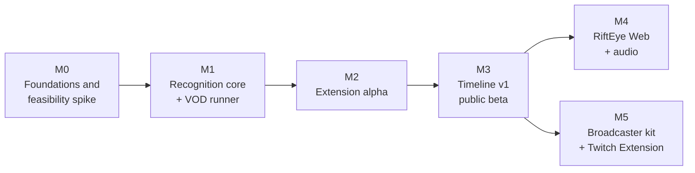

# RiftEye roadmap

Milestones are ordered, not dated. Sizes assume one maintainer plus a few regular contributors, and they are estimates. Every milestone ends with **exit criteria measured on real stream data**, not on synthetic data ([why](research/04-data-and-evaluation.md#48-the-m0-feasibility-spike)).

## M0: Foundations and feasibility (about 2 weeks)

- [x] Repository, licence, CLA, contribution rules, architecture and research docs
- [ ] **Final name** chosen after a trademark search ([D-010](decisions.md#d-010-rifteye-is-a-working-name))
- [ ] Footage: written agreements requested from 3–5 organisers; our own consented recording sessions planned; `sources.yaml` started
- [ ] Catalogue v0: every printing from Riot's public card gallery in the `Card` / `Printing` schema, built on the Maintainer's machine and never redistributed ([D-015](decisions.md#d-015-no-riot-api-no-riot-assets-distributed))
- [x] Timeline logger v0 (`apps/logger`)
- [ ] First 5 matches logged with it
- [x] Feasibility spike tooling (`ml/`: stream simulator with a real H.264 pass, encoders, retrieval metrics)
- [ ] **Feasibility spike run**: accuracy-vs-card-height curves, synthetic and real ([04 §4.8](research/04-data-and-evaluation.md#48-the-m0-feasibility-spike)), plus identification from a visible strip for stacked cards
- [ ] Choose the embedder base model (DINOv2-S vs Perception Encoder S) and the browser detector (RT-DETRv2-OBB vs D-FINE) from the spike ([03](research/03-models-and-licensing.md))

**Exit:** the M0 report is published in `docs/reports/`, with a go / adjust decision per broadcast framing (full-screen vs picture-in-picture, 1080p vs 720p).

## M1: Recognition core and VOD runner (about 4–6 weeks)

- [ ] `ml/synth` v0: synthetic boards with the real codec pass
- [ ] Synthetic stacks: fanned piles, rune rows, attached gear and piles, with full-quad ground truth
- [ ] Detector v0 (`card`, `card_back`), amodal (full quad plus visible fraction): synthetic data plus about 500 verified real frames
- [ ] Rectifier: corner heatmap network retrained on stream crops
- [ ] Embedder v0: fine-tuned with random covering, exported to ONNX (fp16 and int8), float16 index plus manifest, with strip views and a gallery pyramid
- [ ] `ml/evalsuite` v0: frozen real test sets, the leaderboard, per-bucket metrics
- [ ] Python VOD runner: board per sampled frame, naive timeline JSON

**Exit:** detection recall ≥ 95% for cards ≥ 50 px on the out-of-domain test set. Card-level top-1 reported per size bucket. The VOD runner works end to end on 5 matches.

## M2: Browser extension alpha (about 4–6 weeks)

- [ ] Manifest V3 extension for Chrome and Edge: overlay hitboxes and hover card on Twitch and YouTube, in theatre mode and fullscreen
- [ ] Inference host prototype (extension iframe vs content-script worker vs `tabCapture` + offscreen document), then ONNX Runtime Web in a worker (WebGPU, WASM fallback), eco mode, pause when hidden
- [ ] Side panel: live board and a simple timeline
- [ ] Gallery adapter (card data loaded from Riot's public gallery at display time); index download with versioning and the model/index guard
- [ ] Benchmarks on the reference machines ([ARCHITECTURE §9](ARCHITECTURE.md#9-performance-targets-to-be-validated-in-m2))

**Exit:** ≥ 2 Hz detection on an Intel Iris Xe laptop without dropped video frames. Private alpha with about 20 community testers.

## M3: Timeline v1 and public beta (about 6–8 weeks)

- [ ] Tracker with re-ID and cut handling, and covered cards that keep their identity while stacked; event engine v1 over piles (played, cast, moved, exhausted/readied, turn start)
- [ ] Priors: zone and type, legend domains, decklist import, seen-before
- [ ] Layout presets for the main broadcasters (`layouts/*.json`); auto-discovery fallback
- [ ] Opt-in "Wrong card?" corrections into the active-learning queue
- [ ] Data engine running: about 2,000 verified frames and 5,000 identity crops
- [ ] Chrome Web Store public beta, privacy policy, contributor docs for presets and labeling

**Exit:** `card_played` F1 ≥ 0.85 at ±5 s and committed-identity precision ≥ 98% on the out-of-domain test set, with identity kept while covered and false removals reported for stacked cards. Privacy policy and the Legal Jibber Jabber notice in the store listing.

## M4: RiftEye Web and more evidence (later)

- VOD library with precomputed, human-reviewed timelines, searchable by card, legend and player
- The extension shows precomputed timelines on processed VODs (exact sync through the media clock)
- Caster-audio mentions and production-graphics recognition in the fusion
- Firefox port

## M5: Broadcaster kit and Twitch Extension (later)

- Production-PC sidecar (obs-websocket, not a native plugin) that reads the clean overhead camera and drives OBS overlays: card pop-ups on play, board graphics
- Twitch video-overlay extension fed by the kit, so viewers get hover with nothing to install
- Tools for tournament organisers: match timelines exported to their sites. Commercial terms only under a written licence from Riot ([08](research/08-legal-and-policy.md))

## Always open for contributors

- **Layout presets** for new broadcasts, the fastest way to help ([CONTRIBUTING](../CONTRIBUTING.md))
- **Labeling** on the private CVAT project (needs the CLA plus a confidentiality agreement)
- **Localisation** of the extension UI and of card-name lists for caster-audio matching
- **Bug reports** with timestamps on public VODs
