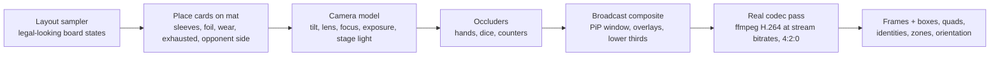
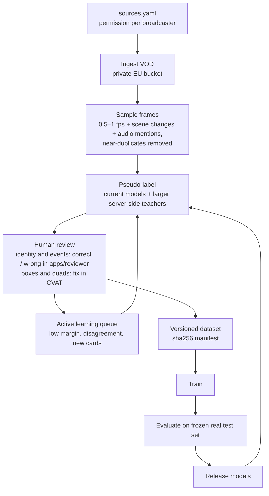

# 04: Data strategy and evaluation

The models are the easy part to write down. The data engine that keeps improving them, and the test sets that keep everyone honest, are the hard part. This chapter covers where data comes from, how it is labeled, how it is governed, and how success is measured.

## 4.1 Four sources of data

| Source | Gives us | Labels | Rights and handling |
|---|---|---|---|
| **Catalogue art** | Every printing, clean | Identity, free | Riot Games IP, from Riot's public card gallery. Used by the Maintainer to build the index and to train. Never re-hosted or redistributed ([D-015](../decisions.md#d-015-no-riot-api-no-riot-assets-distributed)) |
| **Synthetic boards** | Unlimited, varied scenes | Boxes, quads, identity, zone, orientation, all free | The generator is open source. Generated images contain card art, so they are regenerated locally, not published as a dataset |
| **Stream footage** | The real target domain | Pseudo-labels, then human verification | Broadcasts belong to their organisers. Used **only with permission**, stored privately, purgeable per source |
| **Opt-in corrections** from extension users | Hard cases from the wild | Identity corrections | Opt-in, minimal payload, documented in the privacy policy ([§4.10](#410-opt-in-corrections-from-the-extension)) |

## 4.2 Catalogue

- **Content:** every printing of every released set, including alt arts, overnumbered cards, promos and tokens. Localised printings are grouped under the same card.
- **Source:** **Riot's public card gallery**, which carries names, types, domains, costs, text, orientation and 744 × 1039 images. It is a public JSON feed, the one behind the gallery on playriftbound.com: 6 pages of 200, no key. RiftEye does not use the Riot API ([D-015](../decisions.md#d-015-no-riot-api-no-riot-assets-distributed)).
- **Languages:** the feed takes a `locale`. On 2026-09-26 it served its own images for Origins only: Simplified Chinese (`zh_CN`, 371 printings), Traditional Chinese (`zh_TW`, 352) and Korean (`ko_KR`, 375). French, Japanese, German, Spanish and Italian returned the English images. A localised printing has the same art and frame as the English one; only the text changes. Localised rows take their gameplay identity from the English printing with the same collector code.
- **Who fetches it, and when:**
  - The Maintainer's build machine fetches it to train models and build the vector index. The images stay on that machine.
  - The extension fetches it in the viewer's browser at display time.
  - Nothing is re-hosted.
- **Gaps:** the gallery does not list every token, and a listed token can be printed with other art. On 2026-09-26 it had 10 (SFD-T03, UNL-T01–T08, VEN-T04). Missing ones are played on stream: the Mech (SFD-T01) at the Shenyang Regional; the Sand Soldier, which Azir's legend makes, on 67 of 541 tracks at the Los Angeles RQ; and the Sand Soldier, a Tentacle token and the Mech at the Barcelona Regional. Some printings are missing too: the Brush battlefield token at Los Angeles (UNL-T03) and an Order Rune at Barcelona (read as R06b) were printed with art the gallery does not have, so no encoder could match them ([M0 §5.4](../reports/m0-spike.md#54-a-second-camera-los-angeles), [§5.6](../reports/m0-spike.md#56-the-held-out-test-barcelona)). A reviewer who meets a missing token types its name ([§4.4](#44-stream-footage-the-data-engine)), and the label records `none` with that name. The matcher cannot propose a card with no reference image, so tokens get a supplement: names and codes collected from reviews and rules text, with art only from our own permitted footage.
- **Offline research:** `ml/` also reads community mirrors of the gallery that use the same JSON shape. Promos missing from the gallery can come from marketplace catalogues, for internal research only.
- **Shape:** the `Card` / `Printing` schema in [ARCHITECTURE §6](../ARCHITECTURE.md#6-data-contracts), released as versioned files, with a changelog entry per set release.
- **New-set readiness:** when a new set is revealed, its printings enter the catalogue as soon as images exist. The embedder then recognises them zero-shot from art, before any real footage exists.

## 4.3 Synthetic board generator (`ml/synth/`)

Its job is to get the detector, rectifier and embedder into the right neighbourhood before any real frame is labeled, and to cover rare cases forever after.

- **Layout sampler:** plausible Riftbound boards. Legend and champion zones, units in the base and on battlefields, runes, trash and deck piles as `card_back`, exhausted cards rotated 90°, and the opponent's side rotated 180°.
- **Card appearance:** coloured, matte and gloss sleeves, inner sleeves, foil shimmer as a specular overlay, light wear.
- **Camera:** overhead with 0–15° tilt, mild lens distortion, focus blur, exposure and white-balance drift, uneven stage lighting, soft hand shadows.
- **Broadcast composite:** the camera view goes into a random broadcast layout (full screen or picture-in-picture next to player cams and graphics), then gets downscaled to 1080p, 720p or 480p.
- **The codec pass is not optional.** Frames go through a real ffmpeg H.264 encode at 2–8 Mbps with a 2 s keyframe interval, then get decoded. JPEG artifacts are the wrong artifacts. Blocking, ringing, chroma bleed and motion smear from inter-frame prediction are what stream crops actually look like.
- **Mat and table textures** are supplied locally by whoever runs the generator. Official playmat art is Riot IP and is not bundled.
- Physically based rendering (Blender) is a possible v2. The 2D compositor is good enough to start and far cheaper to iterate on.

## 4.4 Stream footage: the data engine

1. **Permission first.** A private `sources.yaml` lists every broadcaster or organiser, the permission status, its scope and a contact. Nothing without a "granted" entry is ingested. A takedown is `registry purge --source <id>`: frames, crops, labels and manifests, everywhere.
2. **Sampling:** 0.5–1 fps, plus every scene change, plus a window around each caster mention of a card name. Perceptual-hash dedup drops the long static stretches.
3. **Pseudo-labels** come from the current models plus larger server-side teachers: a bigger detector, and a VLM for close-ups and graphics. That way humans *correct* rather than draw from scratch.
4. **Human review, not labelling from scratch.** People never label from scratch. The model proposes, and a person answers correct or wrong ([D-018](../decisions.md#d-018-labels-come-from-reviewing-model-proposals)):
   - **Identity and events** go through [apps/reviewer](../../apps/reviewer). Each item is a guess: *is this the card?*, or *what happened in this box?* <kbd>Y</kbd> confirms it. A number key picks one of the next guesses. <kbd>N</kbd> then a typed name corrects it (names come from the catalogue; a card it lacks, such as a token, is typed in). <kbd>S</kbd> means can't tell, and is also the answer for face-down cards. One identity item is one **track**: the same physical card at the same place over consecutive frames, so a single answer labels every crop of it. On the M0 reference VOD, 3,157 crops from 669 overhead frames form 862 tracks, and a 400-item pack covers 960 crops. The Maintainer answered it in 13.6 minutes, and a 400-item pack from the Los Angeles RQ in 18 minutes (1.15 s median), about 15–20 minutes of work per pack.
   - **Boxes and quads** (detector labels) are still fixed in CVAT, starting from the detector's own boxes.
5. **Active learning** decides what goes into a pack. The least confident items go first: a small margin, models that disagree, a newly released card. A seeded random share of the confident rest (10% of each pack) is mixed in as an **audit**. The audit measures how often the unchecked guesses are right, with a 95% interval, and that tells us when confident guesses can be taken as labels without review. `rifteye_ml.reviewpack apply` reports both numbers.

A rough first target: **2,000 verified overhead frames** (about 20–40k card instances) across at least 8 broadcasters for detector domain adaptation, and **5,000 verified identity crops** spread across size buckets for the embedder. The M0 spike ([§4.8](#48-the-m0-feasibility-spike)) will refine both numbers.

## 4.5 Ground-truth timelines

Frame labels measure models. **Timelines measure the product.**

- A small **timeline logger** (a web page next to the video) records events with hotkeys: event type, player, card by typeahead, and the timestamp captured automatically. The logger can scrub back and correct.
- It exports the same `TimelineEvent` JSON the engine produces, so scoring is a diff.
- A 10% sample is logged by two people independently, and the agreement between them sets the ceiling for what a model can be expected to hit.
- **Target for the v1 test set:** 30 fully logged matches across at least 5 broadcasters and events.

## 4.6 Splits: avoid the easy leak

Frames from the same match are near-duplicates. Frames from the same broadcast share camera, lighting, sleeves and players. **Split by event, never by frame.**

- **In-domain test:** broadcasters seen in training, but events never seen.
- **Out-of-domain test:** broadcasters never seen in training. This is the product's everyday situation: a new stream the extension has never met. It is the headline number.
- **Zero-shot slice:** cards that have no real training crops at all, only catalogue art. It measures readiness for the next set.

## 4.7 Metrics and the leaderboard

| Level | Metrics |
|---|---|
| Detection | AP50; recall per card-height bucket (< 50, 50–80, 80–120, > 120 px) and per visible fraction for covered cards |
| Identification | Top-1 and top-5 at card level and printing level, per bucket; the same for covered cards by visible fraction; precision–coverage curve of the commit rule |
| Tracking | Identity kept while covered (share of covered time with the right identity); false removals (tracks ended while the card was still on the table); ID switches |
| Timeline | Event F1 per event type at ±5 s; board-state accuracy (share of visible cards correctly named at sampled instants) |
| Runtime | Detection Hz, embedding latency, dropped video frames, per reference machine ([ARCHITECTURE §9](../ARCHITECTURE.md#9-performance-targets-to-be-validated-in-m2)) |

Every evaluation appends a row to `ml/evalsuite/leaderboard.json` with the model tag, git sha and the sha256 of the dataset manifest it was scored on. Frames stay private, so contributors submit models and maintainers score them on the hidden test sets. It is a closed leaderboard in the style of academic benchmarks: contributors can compete without anyone redistributing broadcast footage.

## 4.8 The M0 feasibility spike

This comes before any large build. It is about a week of work and settles hypotheses H1–H3 from [02](02-vision-pipeline.md#22-how-big-is-a-card-on-a-stream).

1. **Synthetic curve.** Degrade the art of every printing to card heights of 40, 60, 80, 120 and 160 px, and pass each through H.264 at 2, 4 and 6 Mbps. Measure retrieval top-1 for 2–3 candidate backbones, both pretrained and after a quick fine-tune.
2. **Real curve.** Hand-label about 300 real crops from 3–5 permitted VODs, spread across the same buckets. Measure the same models.
3. **Read the gap.** Earlier card work showed synthetic accuracy overstating real accuracy by tens of points ([06](06-prior-art-and-starting-point.md)). The size of the gap here tells us how much real data M1 needs, and whether table-only identification is viable at 720p.

Deliverable: a one-page report with the two accuracy-vs-pixels curves, committed to `docs/reports/`.

## 4.9 Dataset governance rules

1. **Never in git:** frames, crops, card art, VODs, audio. `.gitignore` covers the common extensions, and a CI check will reject image and video files outside `docs/`.
2. **Manifests only:** every dataset is a sha256-per-file manifest plus a versioned private bucket. A leaderboard row names the exact bytes it was scored on.
3. **Purge by source** for takedown requests.
4. **Labels are contributions.** Labelers sign the [CLA](../../CLA.md). Anyone who sees private frames also signs a confidentiality agreement.
5. **Model cards** document training data by category (catalogue, synthetic, permitted broadcasts), the evaluation results and known failure modes.

## 4.10 Opt-in corrections from the extension

- A **"Wrong card?"** button lets the viewer pick the right card. If they have opted in, the extension sends: the 176 × 246 rectified crop, the top-5 candidates, the model and catalogue versions, and the stream platform and video ID for deduplication.
- It does not send account identifiers, screenshots of the full frame or browsing data. Retention and legal basis are in the privacy policy before this ships ([08](08-legal-and-policy.md)).
- Corrections go into the active-learning queue, **never straight into training**. A human verifies each one first. This keeps the loop resistant to both mistakes and deliberate poisoning.
